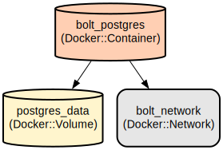

# Desafio Bolt Energy

Este aplicativo Spring Boot baixa, processa e exibe automaticamente dados sobre usinas de geração de energia no Brasil. Ele fornece uma visão atualizada diariamente das 5 maiores usinas com base em sua potência outorgada.

O sistema obtém os dados da ANEEL (Agência Nacional de Energia Elétrica) por meio do portal de dados abertos, processa o arquivo CSV, armazena as informações em um banco de dados PostgreSQL e as apresenta tanto por meio de endpoints REST quanto por uma interface web. A aplicação conta com atualizações agendadas dos dados, tratamento robusto de erros e uma camada de apresentação limpa.

## Estrutura do Repositório
```
.
├── docker-compose.yml         # Config docker para banco de dados Postgress
├── mvnw/mvnw.cmd              # Script maven
├── pom.xml                    # Dependências e configs maven
└── src/
    ├── main/
        │   ├── kotlin/           # Código fonte da aplicação
    │   │   └── com/bolt/challenge/ralie_usinas/
    │   │       ├── controller/     # Controllers REST e Web
    │   │       ├── entity/         # Modelos de classes
    │   │       ├── repository/     # Camada de acesso ao banco de dados
    │   │       └── service/        # Lógica de negocio e acesso/download ao CSV
    │   └── resources/
    │       ├── application.properties  # Configurações da aplicação
    │       └── templates/             # Templates HTML Thymeleaf
    └── test/                  # Classes de teste
```

## Intruções de Uso
### Pré-requisitos

- Kit de Desenvolvimento Java (JDK) 17 ou superior
- Docker e Docker Compose para executar o PostgreSQL
- Maven 3.9.x (fornecido via wrapper)
- PostgreSQL 15 (fornecido via Docker)

### Intalação

1. Clone o repositorio:
```bash
git clone [repository-url]
cd ralie-usinas
```

2. Inicie o banco PostgreSQL:
```bash
docker-compose up -d
```

3. Build e run a aplicação:
```bash
mvnw.cmd spring-boot:run
```

### Início rápido
1. Acesse a interfaceweb:
```
http://localhost:8080/usinas/view
```

2. Acesse a REST API:
```bash
curl http://localhost:8080/usinas/top5
```

### Mais detalhes

1. Consiga as top 5 usinas por capacidade:
```bash
curl -X GET http://localhost:8080/usinas/top5 -H "Accept: application/json"
```

Exemplo de resposta:
```json
[
  {
    "ideNucleoCEG": 1,
    "nomEmpreendimento": "UHE Belo Monte",
    "sigUFPrincipal": "PA",
    "mdaPotenciaOutorgadaKw": 11233100
  }
]
```

### Troubleshooting

1. Problemas de conexão com banco de dados
- Erro: "Unable to connect to PostgreSQL"
- Solução: 
```bash
# Check if PostgreSQL container is running
docker ps
# If not running, start it
docker-compose up -d
```

2. Problemas com  download do CSV
- Erro: "Failed to download CSV file"
- Solução:
```bash
# Check logs for detailed error
docker logs ralie-usinas
# Verify network connectivity to ANEEL's server
curl -v https://dadosabertos.aneel.gov.br/dataset/57e4b8b5-a5db-40e6-9901-27ca629d0477/resource/4a615df8-4c25-48fa-bbea-873a36a79518/download/ralie-usina.csv
```

## Data Flow
A aplicação baixa automaticamente os dados das usinas do portal de dados abertos da ANEEL, processa essas informações e as armazena em um banco de dados PostgreSQL para consulta e exibição eficientes.

```ascii
[ANEEL CSV] --> [CsvDownloadService] --> [PostgreSQL DB] --> [REST API/Web UI]
                      |                         |                    |
                      v                         v                    v
              [Processamento de dados]        [Persistencia de dados]    [Apresentação de dados]
```

Key component interactions:
1. CsvDownloadService baixa os dados diariamente 
2. Dados do CSV é convertida e validada antes de salvar no banco
3. O repositório UsinaGeradoraRepository gerencia as operações com o banco de dados
4. Os controladores fornecem os dados por meio de API REST e interface web
5. Templates Thymeleaf renderizam a visualização web
6. Tratamento de erros e registro de logs em todo o pipeline

## Infra



### Banco de dados (PostgreSQL)
- Tipo: PostgreSQL 15
- Nome doContainer: bolt_postgres
- Credenciais:
  - Banco: ralie
  - Usuário: bolt_user
  - Senha: bolt_pass
- Porta: 5432
- Volume: postgres_data for persistence
- Rede: bolt_network (bridge)
